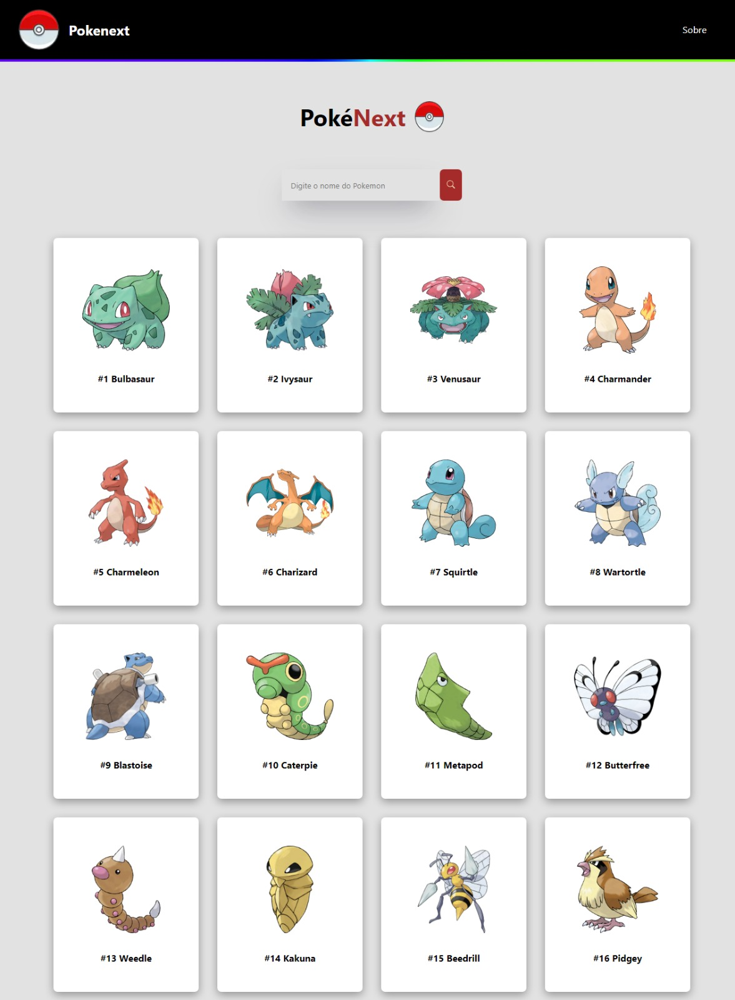

# Pokenext - Uma Aplicação Next.js de Pokedex

Pokenext é uma aplicação web construída utilizando Next.js, uma estrutura de desenvolvimento web React de última geração. Essa aplicação permite que os usuários explorem os primeiros 251 Pokémon da franquia Pokémon.

## Tecnologias Utilizadas

- **Next.js**: Next.js é uma estrutura de desenvolvimento web que combina React com funcionalidades avançadas, como renderização do lado do servidor (SSR) e renderização estática (SSG). Isso oferece um desempenho aprimorado e melhor SEO para a aplicação.

- **SPA (Single Page Application)**: A aplicação Pokenext utiliza o conceito de SPA, em que a navegação ocorre sem precisar recarregar a página inteira. Isso é possível graças ao uso do roteamento do Next.js, que permite renderizar apenas os componentes necessários para cada página, proporcionando uma experiência de usuário mais suave.

- **Hooks**: A aplicação faz uso extensivo dos React Hooks, como `useState` e `useEffect`, para gerenciar o estado dos componentes e realizar efeitos colaterais, como fazer chamadas à API.

- **Fetch API**: O Pokenext utiliza a Fetch API, uma API nativa do JavaScript, para fazer requisições à API da PokéAPI (https://pokeapi.co/). A Fetch API permite buscar informações sobre os Pokémon e fornecer uma experiência dinâmica para o usuário.

- **CSS Modules**: Para garantir uma estilização modular e evitar conflitos de estilos, o Pokenext adota a abordagem do CSS Modules. Com o CSS Modules, os estilos são aplicados localmente a cada componente, mantendo-os encapsulados e isolados de outros componentes.

## Funcionalidades

A aplicação Pokenext oferece as seguintes funcionalidades:

1. Listagem de Pokémon: A página inicial mostra uma lista dos primeiros 251 Pokémon, exibindo seus nomes e imagens. Os Pokémon são carregados a partir da API da PokéAPI por meio de uma requisição Fetch.

2. Detalhes do Pokémon: Ao clicar em um Pokémon da lista, o usuário é redirecionado para a página de detalhes do Pokémon. Essa página exibe informações mais detalhadas sobre o Pokémon, incluindo seu tipo, habilidades e estatísticas.

3. Pesquisa de Pokémon: A aplicação possui uma barra de pesquisa que permite ao usuário buscar um Pokémon específico. A pesquisa é realizada em tempo real e os resultados são atualizados à medida que o usuário digita.

## Como executar o projeto

Para executar o Pokenext em sua máquina local, siga as etapas abaixo:

1. Faça o clone do repositório:

   ```bash
   git clone https://github.com/vinidyoxes/pokenext
2. Navegue até o diretório do projeto:

   ```bash
   cd pokenext
3. Instale as dependências:

   ```bash
   npm install
4. Inicie o servidor de desenvolvimento:
   ```bash
   npm run dev
5. Acesse a aplicação em seu navegador em http://localhost:3000.





